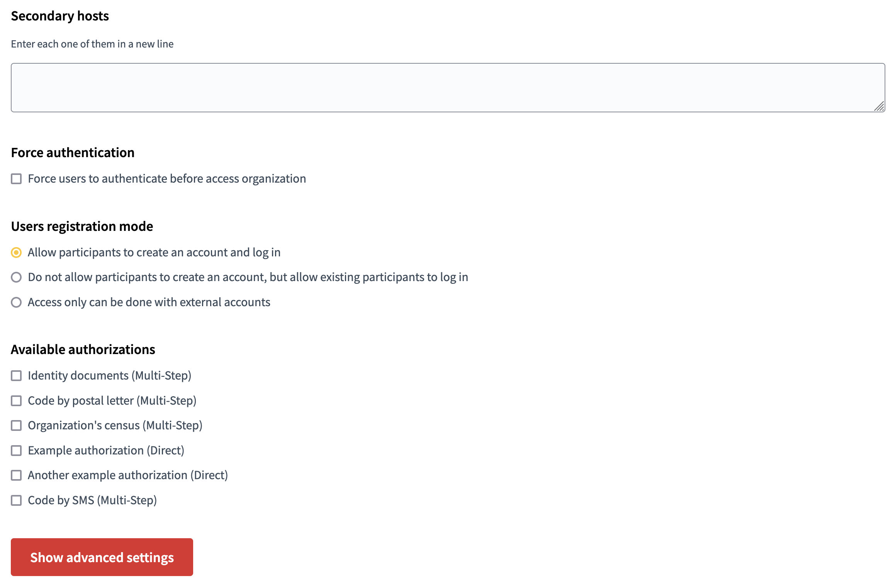

# Authorization handlers

Decidim offers several methods for allowing participants to get authorization to perform certain privileged actions. This module implements several of those methods and also offers a way for installation to implement their custom verification methods.

## What is the need ?

There is two existing authorization handlers available on `v0.27` : 
- Extended Socio Demographic Authorization Handler
- Phone Authorization Handler

We want a new module named `decidim-module-additional_authorization_handlers` which contains these two authorization handlers and available on **v0.29**

## Product overview

## Decidim Authorization Handler

**As a System user**
I expect to be able to select the authorization handlers directly from the system panel

source: https://decidim-029.osp.dev/system/organizations/1/edit

**As an administrator**
I expect to select the authorization handlers directly from the back office

source: https://decidim-029.osp.dev/admin/participatory_processes/budget-participatif/components?locale=en

source: https://decidim-029.osp.dev/admin/participatory_processes/budget-participatif/components/5/permissions/edit?locale=en

**As a user**

I expect to be able to add and edit my authorization handlers from my profile

I expect to be able to fill authorization from my profile

I expect to be able to revalidate my authorization from my profile

### Extended Socio Demographic Authorization handler

Required fields in AH form :

- **last_name**: String (mandatory)
- **first_name**: String (mandatory)
- **address**: String (mandatory)
- **postal_code**: String (mandatory)
- **city**: String (mandatory)
- **email**: String
- **phone_number**: String
- **resident**: Boolean (mandatory)
- **rgpd**: Boolean (mandatory)

Validations : 

- **last_name**: presence: true
- **first_name**: presence: true
- **address**: presence: true
- **postal_code**: numericality: { only_integer: true }, presence: true
- **city**: presence: true
- **email**: format: { with: Devise.email_regexp }, if: ->(form) { form.email.present? }
- **phone_number**: (0|\+33)[1-9]([-.]?[0-9]{2}){3}([-.]?[0-9]{2})
- **resident**: acceptance: true, presence: true
- **rgpd**: acceptance: true, presence: true

At least an email or phone number is required

## Phone authorization handler

* **phone_number**: String (mandatory)

Validations

- **phone_number**, length: { in: 10..12 }, format: { with: /\A(\+33|0)[1-9][0-9]{8}\z/, message: I18n.t(:phone_number_format, scope: "errors.messages") }, presence: true

### Exports

**As an administrator**

When I export my proposals from BO
I expect to have the authorization handlers data in the export file

**As a user**

When I export my proposals from FO
I expect not to have the authorization handlers data in the export file

## Resources
* [Decidim Documentation](https://docs.decidim.org/en/v0.29/customize/authorizations/)
* [Decidim Extended Socio AH on branch release/0.27-stable](https://github.com/OpenSourcePolitics/decidim-module-extended_socio_demographic_authorization_handler/tree/release/0.27-stable)
* [Decidim Phone AH on branch release/0.27-stable](https://github.com/OpenSourcePolitics/decidim-module_phone_authorization_handler/tree/release/0.27-stable)