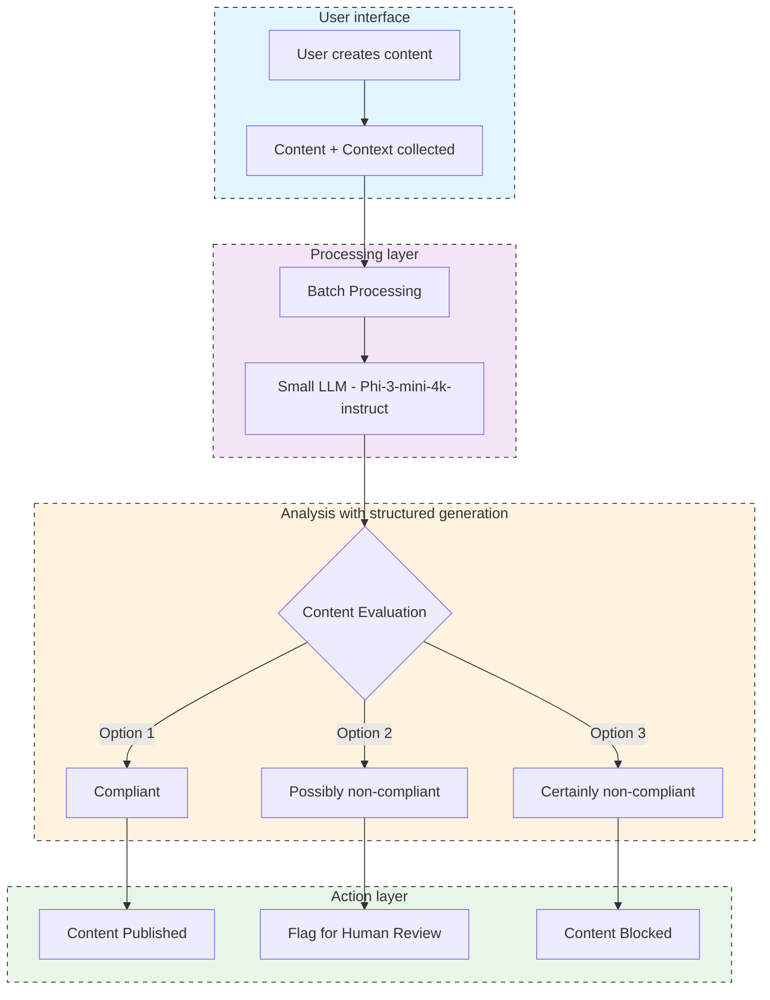

# Decidim moderation bot

## History and challenges

The initial version of our solution, **[Spam Bot Detection](https://github.com/OpenSourcePolitics/decidim-spam_detection)**, was primarily focused on detecting bots based on account creation characteristics. While this method was effective in some cases, it had a major drawback.

This drawback was its **inability to analyze content posted by users**. By focusing solely on suspicious account creation patterns and profile information, it failed to catch hate speech and other inappropriate content.

## Solution: a moderation bot

In response to these limitations, we're planning to introduce a new solution: a **moderation bot**, that would go beyond simple bot detection by also focusing on content posted by users.

Here's how it would work from an administrator's perspective:

### Administrator operations

From the platform's back office, administrators would have the ability to define moderation rules specific to their community. These rules can include various criteria such as types of language to monitor, sensitive themes, or inappropriate behaviors specific to their context.

Administrators can also select a confidence threshold. This threshold determines at what level of certainty suspicious users or content are automatically blocked. This allows for initial automated filtering while leaving room for human review.

Reports generated by the moderation bot would be sent directly via email to platform administrators or moderators. They could then review the reports and decide if the content should be moderated. If content is indeed deemed inappropriate, it is hidden from the platform, ensuring a healthy and respectful environment for all users.

### Comparison

| Feature | Spam Bot Detection (current) | Moderation Bot (to be developed) |
|---------|----------------------------|----------------------------------|
| Spam Bot Detection | ✅ Detects majority of spam bots | 🤝 Compatible with existing spam bot detection |
| Action on Spam | ✅ Blocks or flags spam bots | ✅ Would moderate based on content |
| Detection Method | 🚫 Based only on user profile | ✅ Would analyze content and context |
| Content Analysis | 🚫 Doesn't detect harmful content | ✅ Would detect harmful content in context |
| Modern Bot Defense | 🚫 Cannot detect sophisticated bots | ✅ Would be difficult for spammers to bypass |
| Image Analysis | - | 🚫 No illicit image detection in first version |

### Technical approach: using language models to evaluate content

The technical operation of the moderation bot relies on the advanced use of open-parameter language models. Their advantage is the ability to evaluate content in context rather than just in isolation and/or semantically.

The process begins when users post content on the platform. This content, along with contextual information such as other comments, the type of feature used, or the consultation title, is then sent to the illicit content detection model ✉️

Our moderation system will use a language model with structured generation (powered by the Outlines library). This will allow to impose to the language model the obligation to answer with one of the 3 options:

- compliant 

- possibly non-compliant

- certainly non-compliant

We will use a small language model such as Phi-3-mini-4k-instruct for this purpose. This new approach, complementary to the previous one (Spam Bot Detection), will enable **complete moderation** by targeting not only spam accounts but also all types of content that violate platform rules, including hate speech.

The use of **open parameter** language models ensures high standards of transparency.

Finally, we will try to reduce as much as possible the environmental footprint of this solution by:

- batching
- using the smallest possible models 
- using servers that use renewable energy sources

