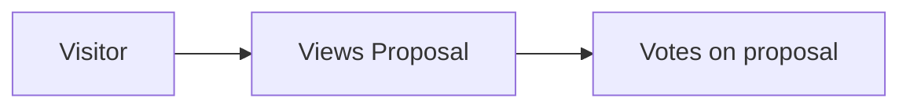

# Anonymous voting on Decidim

## Challenge
Converting platform visitors into active contributors is a significant hurdle in digital participation. Current data shows that requiring account creation as the first step creates friction that prevents many potential contributors from engaging with the platform. Enabling simple initial actions without account creation leads to higher engagement rates and subsequently more registered users.

## Solution
Implement anonymous voting capability for proposals on Decidim, allowing first-time visitors to engage immediately with content before creating an account.

### Inspiration
Make.org platform's approach, which successfully implements a system where visitors can immediately interact with a sequence of published proposals through simple pro/against/neutral voting mechanisms.

https://github.com/user-attachments/assets/c0928961-fa9a-4e97-8b4f-b5c0700c191e

### User stories

1. As a platform visitor:
   - I want to vote on proposals without creating an account
   - I want to see the immediate impact of my vote on the voting statistics
   - I want to receive a clear prompt about the benefits of creating an account after voting
   - I want to be able to convert my anonymous participation into a registered account later

2. As a platform administrator:
   - I want to enable/disable anonymous voting for specific voting processes
   - I want to distinguish between anonymous and authenticated votes in the analytics (Decidim back-office)
   - I want to be assured that the voting system remains fair and transparent
   - EXTRA: I want to access metrics about conversion rates from anonymous voters to registered users (while remaining compliant with GDPR)

## Important Constraints/Considerations

1. Technical constraints:
   - The system must prevent multiple votes from the same visitor (session or IP address-based restrictions, protection from bots via an invisible Captcha)
   - If a user converts from visitor to user in the same session, the votes should be assigned to the users account

2. Scope limitations:
   - Endorsements remain restricted to registered users (due to public profile requirements)

3. Data:
   - Clear distinction between anonymous and authenticated votes in the database

4. UX Requirements:
   - Popup to encourage account creation after voting

6. Administrative Control:
   - Granular controls for enabling/disabling anonymous voting on specific components
   - The same voting rules should apply to connected users and visitors
