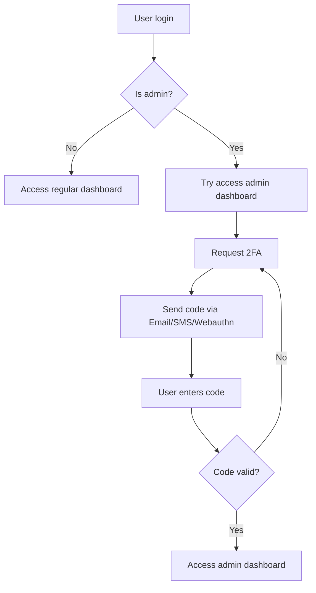

# Two-factor authentication (2FA) spec

Implement 2FA for admin dashboard access in Decidim, requiring verification only when accessing admin features.

## Core Requirements

### Authentication Flow
1. Users login normally with email/password/SSO
2. 2FA triggers only when accessing admin dashboard
3. Regular users bypass 2FA completely

### 2FA Methods
- Email verification code
- SMS verification code  
- Webauthn

### Configuration options
Configure via either:
- `/system` page 
- Admin panel settings section

Example of how it could look like in the admin panel:

## Implementation Notes
- Maintain existing authentication for regular users
Weba- Add 2FA layer only for admin dashboard access
- Support multiple 2FA methods simultaneously

## Security Considerations
- Secure token storage
- Rate limiting for verification attempts
- Session timeout rules for verified states
